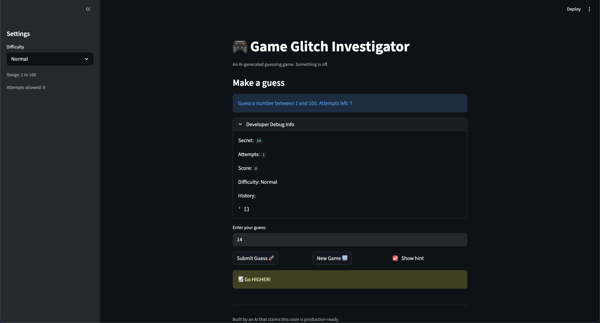

# 🎮 Game Glitch Investigator: The Impossible Guesser

## 🚨 The Situation

You asked an AI to build a simple "Number Guessing Game" using Streamlit.
It wrote the code, ran away, and now the game is unplayable. 

- You can't win.
- The hints lie to you.
- The secret number seems to have commitment issues.

## 🛠️ Setup

1. Install dependencies: `pip install -r requirements.txt`
2. Run the broken app: `python -m streamlit run app.py`

## 🕵️‍♂️ Your Mission

1. **Play the game.** Open the "Developer Debug Info" tab in the app to see the secret number. Try to win.
2. **Find the State Bug.** Why does the secret number change every time you click "Submit"? Ask ChatGPT: *"How do I keep a variable from resetting in Streamlit when I click a button?"*
3. **Fix the Logic.** The hints ("Higher/Lower") are wrong. Fix them.
4. **Refactor & Test.** - Move the logic into `logic_utils.py`.
   - Run `pytest` in your terminal.
   - Keep fixing until all tests pass!

## 📝 Document Your Experience
### Purpose of the game

- A Streamlit number guessing game where the player tries to guess a secret number within a limited number of attempts.
- The game provides hints telling the player whether their next guess should be higher or lower.
- The goal of this project was to debug the broken AI-generated code and practice using AI tools (especially Copilot) to investigate and repair bugs.

### Bugs that were discovered

- The hint system was inconsistent and sometimes completely wrong (for example it told me to go higher when my guess was already higher than the secret number).
- The attempt counter did not match the number of attempts shown in the sidebar.
- Clicking **New Game** did not always reset the game properly and sometimes kept the previous game state.
- The hint checkbox behaved strangely and sometimes required another guess before the hint appeared again.
- Some parts of the code mixed UI logic and game logic, which made debugging more confusing.

### Fixes that were applied

- Moved the core game logic (`get_range_for_difficulty`, `parse_guess`, `check_guess`, `update_score`) from `app.py` into `logic_utils.py`.
- Fixed the comparison logic in `check_guess` so the hints correctly match the relationship between the guess and the secret number.
- Simplified the hint behavior so the message returned by `check_guess` is used directly instead of patching it in the UI.
- Repaired the **New Game** behavior by resetting the relevant Streamlit session state variables so the game actually starts fresh.
- Added `pytest` tests for `check_guess` to verify the outcomes `"Win"`, `"Too High"`, and `"Too Low"` behave correctly.

## 📸 Demo

## 🚀 Stretch Features

- [ ] [If you choose to complete Challenge 4, insert a screenshot of your Enhanced Game UI here]
